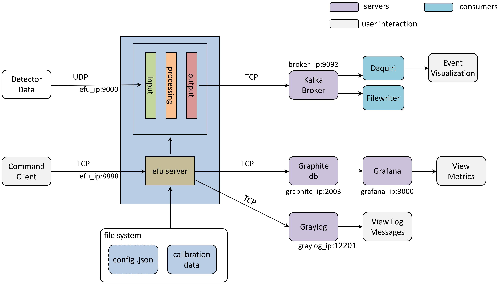

# EFU Architecture

The Event Formation Unit (EFU) is a user space application running on Linux and MacOS.
The target OS for ESS operations is CentOS.

The application consists of a main application responsible for control and periodic reporting,
and one or more detector threads responsible for data recption, event formation, etc. An overview
describing the EFU and four prototype detector implementations is given in https://arxiv.org/abs/1807.03980

## Processes
### main
The main function is responsible for parsing launch-time configuration parameters, performing system hardware checks, launching detector plugins, receiving and reacting to run-time commands, periodic publishing of statistics and the termination of the threads and the process itself.

*prototype2/efu/main.cpp*


### Threads
The behaviour of the processing threads is completely determined by the author of that plugin.

## Interfaces



### Command line Interfaces
The EFU exposes a command line interface based on TCP for runtime control and configuration.

The default behaviour is for the command server to listen on TCP port 8888, but this can be changed with the **-m** option.

The CLI interface consists of a multi-client server and a command parser. Some commands are common and some are detector specific. The important files are

*prototype2/efu/Server.cpp* <br>
*prototype2/efu/Parser.cpp*


#### Global commands
Registering a new global command (Parse.cpp) consist of creating a parser for that command, and registering the function.

    static int version_get(std::vector<std::string> cmdargs, char *output, unsigned int *obytes) {
      ...
      return Parser::OK;
    }
    ...
    registercmd("VERSION_GET", version_get);

#### Detector-specific commands
To register a detector specific command we need to add the parser functions to the detector class.

    class CSPEC : public Detector {
    public:
      ...
      int LoadCalib(std::vector<std::string> cmdargs, UNUSED char *output, UNUSED unsigned int *obytes);
      ...
    };

    int CSPEC::LoadCalib(std::vector<std::string> cmdargs, char *output, unsigned int *obytes) {
      ...
      return Parser::OK;
    }

    AddCommandFunction("CSPEC_LOAD_CALIB",
                       [this](std::vector<std::string> cmdargs, char *output,
                              unsigned int *obytes) {
                         return CSPEC::LoadCalib(cmdargs, output, obytes);
                       });

An example of how detector-specific commands are registered can be found in *prototype2/multigrid/mgcncs2.cpp*


### Statistics Interfaces
The statistics interface is responsible for connecting (and reconnecting) to a Carbon database for submitting statistics.

For a brief summary of how this is used see
https://www.linkedin.com/pulse/creating-cool-dashboards-grafana-morten-jagd-christensen/

Every registered statistics counter will be published about once per second. The default behaviour is to publish stats in *localhost*
and tcp port 2003 (Carbon). The server ip address can be changed by command line option **-g**

To create a useful stat counter three things are needed:

* a uint64_t variable
* association of the variable with a metric name
* regular updates of the counter

A Carbon stat has a hierarchical structure consisting of ascii characters separated by dots. For example: ````efu.input.rx_bytes````


We recommend that stats are grouped in a struct or similar, but this is not a requirement.

    // Setup initially
    struct {
      int64_t rx_packets;
      int64_t rx_bytes;
      ...
    } ALIGN(64) mystats;
    ...
    Stats.create("rx_packets", mystats.rx_packets);
    ...
    // in main loop
    mystats.rx_packets++;

Stats and stat publishing is defined in

*prototype2/common/NewStats.cpp* <br>
*prototype2/common/StatPublisher.cpp*

### Detector Interfaces
