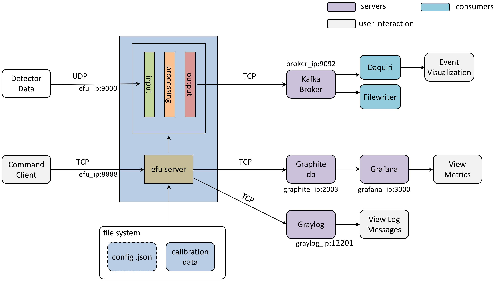

# EFU Architecture

The Event Formation Unit (EFU) is a user space application running on Linux and MacOS.
The target OS for ESS operations is CentOS.

The application consists of a main application responsible for control and periodic reporting,
and one or more detector threads responsible for data recption, event formation, etc. An overview
describing the EFU and four prototype detector implementations is given in https://arxiv.org/abs/1807.03980

## Processes
### main
The main function is responsible for parsing launch-time configuration parameters, performing system hardware checks, launching detector plugins, receiving and reacting to run-time commands, periodic publishing of statistics and the termination of the threads and the process itself.


[src/efu/main.cpp](https://github.com/ess-dmsc/event-formation-unit/blob/master/src/efu/main.cpp)


### Threads
The behaviour of the processing threads is completely determined by the author of that plugin. In order for a plugin to be usable it needs to adhere to the detector C++ interface. This is described in a later section.

Four examples of already implemented detector interfaces, somewhat alike but also differing are found here

[Gd-GEM](https://github.com/ess-dmsc/event-formation-unit/blob/master/src/modules/ess/gdgem/gdgem.cpp) <br>
[Multi-Grid](https://github.com/ess-dmsc/event-formation-unit/blob/master/src/modules/ess/multigrid/mgmesytec.cpp) <br>
[Multi-Blade](https://github.com/ess-dmsc/event-formation-unit/blob/master/src/modules/ess/multiblade/mbcaen.cpp) <br>
[SoNDe](https://github.com/ess-dmsc/event-formation-unit/blob/master/src/modules/ess/sonde/sonde.cpp)


## Interfaces



### Data Interface
The data interface of the EFU is completely open. Current detector implementations use UDP based on BSD Sockets. If using the provided Socket abstraction, a UDP receiver can be setup as follows

    #include <common/Socket.h>
    ...
    Socket::Endpoint local(EFUSettings.DetectorAddress.c_str(),
                       EFUSettings.DetectorPort);
    UDPReceiver datareceiver(local);
    ...
    int rx_bytes = datareceiver.receive(buffer, buffersize);

The default behavior is to listen on all ip interfaces (0.0.0.0) and on UDP port 9000. This can be changed with the command line options **-i** and **-p**

    efu -i 172.17.5.35 -p 9001

### Logging interface
The EFU supports logging via graylog. The current implementation can be found at https://github.com/ess-dmsc/graylog-logger

The logging interface should probably not be used in the fast data path, but it is used for logging in the main process.

    #include <common/Log.h>
    ...
    Log::AddLogHandler(new GraylogInterface(GLConfig.address, GLConfig.port));
    ...
    LOG(PROCESS, Sev::Warning, "CSPEC_SHOW_CALIB: wrong number of arguments");

The default behavior is to send log messages to localhost on port 12201. The server ip address can be changed with the command line option **-a**.

    efu -a 10.1.2.3

### Kafka interface
There is no requirement to use Kafka. But if you send event data in the ESS format this can be done using the Producer class. (Will soon be replaced by ????)

The default behaviour is to use Kafka broker on localhost:9092, but this can be changed using the **-b** option.

    efu -b "172.17.5.38:9092"

### Command line Interfaces
The EFU exposes a command line interface based on TCP for runtime control and configuration.

The default behaviour is for the command server to listen on TCP port 8888, but this can be changed with the **-m** option.

    efu -m 8899

The CLI interface consists of a multi-client server and a command parser. Some commands are common and some are detector specific. The important files are

*src/efu/Server.cpp* <br>
*src/efu/Parser.cpp*

#### Global commands
Registering a new global command (Parse.cpp) consist of creating a parser for that command, and registering the function.

    static int version_get(std::vector<std::string> cmdargs, char *output, unsigned int *obytes) {
      ...
      return Parser::OK;
    }
    ...
    registercmd("VERSION_GET", version_get);


### Statistics Interfaces
The statistics interface is responsible for connecting (and reconnecting) to a Carbon database for submitting statistics.

For a brief summary of how this is used see
https://www.linkedin.com/pulse/creating-cool-dashboards-grafana-morten-jagd-christensen/

Every registered statistics counter will be published about once per second. The default behaviour is to publish stats in *localhost*
and tcp port 2003 (Carbon). The server ip address and tcp port can be changed by command line options **-g** and **-o**.

    efu -g 172.17.12.31 -o 4005

To create a useful stat counter three things are needed:

* a uint64_t variable
* association of the variable with a metric name
* regular updates of the counter

A Carbon stat has a hierarchical structure consisting of ascii characters separated by dots. For example: ````efu.input.rx_bytes````


We recommend that stats are grouped in a struct or similar, but this is not a requirement.

    // Setup initially
    struct {
      int64_t rx_packets;
      int64_t rx_bytes;
      ...
    } ALIGN(64) mystats;
    ...
    Stats.setPrefix("efu.input");
    Stats.create("rx_packets", mystats.rx_packets);
    ...
    // in main loop
    mystats.rx_packets++;

Stats and stat publishing is defined in

*src/common/NewStats.cpp* <br>
*src/common/StatPublisher.cpp*

### Detector Interfaces
All detector implementations must conform to the Detector interface
https://github.com/ess-dmsc/event-formation-unit/blob/master/src/common/Detector.h

A minimal viable detector plugin is shown in
https://github.com/ess-dmsc/event-formation-unit/blob/master/doc/minimaldetector/minimaldetector.cpp

#### Detector interface methods
The following functions must be provided be the developer of a new detector plugin


#### Detector threads


#### Detector-specific commands
TBA
