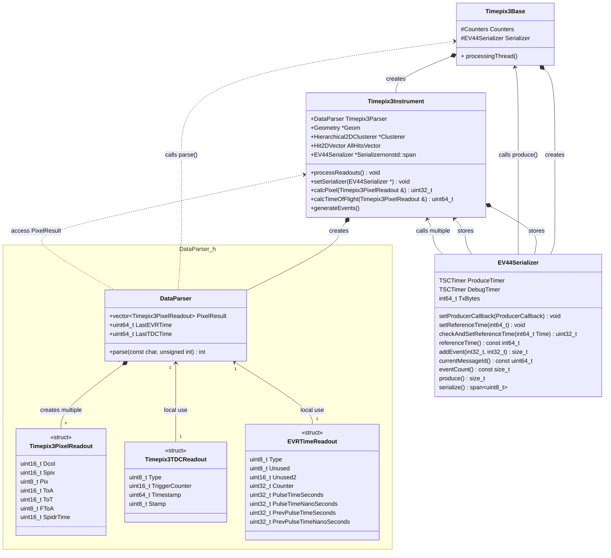

## Brief description
blabla
## Class diagram of the detector module

```mermaid
classDiagram
    Timepix3Base*--Timepix3Instrument : creates
    Timepix3Base*--EV44Serializer : creates
    Timepix3Instrument*--EV44Serializer : stores
    Timepix3Base<--EV44Serializer : calls produce()
    Timepix3Instrument<--EV44Serializer : stores
    Timepix3Instrument<--EV44Serializer : calls multiple
    Timepix3Instrument*--DataParser : creates
    Timepix3Base<..DataParser : calls parse()
    Timepix3Instrument<..DataParser : access PixelResult
    DataParser "1" *-- "n" Timepix3PixelReadout : creates multiple
    DataParser "1" <-- "1" Timepix3TDCReadout : local use
    DataParser "1" <-- "1" EVRTimeReadout : local use

    class Timepix3Base {
        #Counters Counters
        #EV44Serializer Serializer
        + processingThread()
    }
    class Timepix3Instrument {
        +DataParser Timepix3Parser
        +Geometry *Geom
        +Hierarchical2DClusterer *Clusterer
        +Hit2DVector AllHitsVector
        +EV44Serializer *Serializernonstd::span<const uint8_t>
        +processReadouts() void
        +setSerializer(EV44Serializer *) void
        +calcPixel(Timepix3PixelReadout &) uint32_t
        +calcTimeOfFlight(Timepix3PixelReadout &) uint64_t
        +generateEvents()
    }
    class EV44Serializer {
        TSCTimer ProduceTimer
        TSCTimer DebugTimer
        int64_t TxBytes
        setProducerCallback(ProducerCallback) void
        setReferenceTime(int64_t) void
        checkAndSetReferenceTime(int64_t Time) uint32_t
        referenceTime() const int64_t
        addEvent(int32_t, int32_t) size_t
        currentMessageId() const uint64_t
        eventCount() const size_t
        produce() size_t
        serialize() span~uint8_t~
    }
    namespace DataParser_h {
        class DataParser {
            +vector~Timepix3PixelReadout~ PixelResult
            +uint64_t LastEVRTime
            +uint64_t LastTDCTime
            +parse(const char, unsigned int) int
        }
        class Timepix3PixelReadout {
            <<struct>>
            uint16_t Dcol
            uint16_t Spix
            uint8_t Pix
            uint16_t ToA
            uint16_t ToT
            uint8_t FToA
            uint16_t SpidrTime
        }
        class Timepix3TDCReadout {
            <<struct>>
            uint8_t Type
            uint16_t TriggerCounter
            uint64_t Timestamp
            uint8_t Stamp
        }
        class EVRTimeReadout {
            <<struct>>
            uint8_t Type
            uint8_t Unused
            uint16_t Unused2
            uint32_t Counter
            uint32_t PulseTimeSeconds
            uint32_t PulseTimeNanoSeconds
            uint32_t PrevPulseTimeSeconds
            uint32_t PrevPulseTimeNanoSeconds
        } 
    }
```