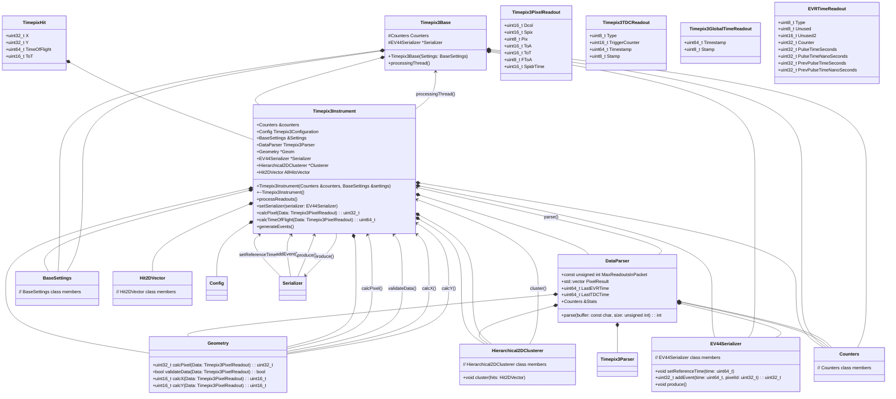

## Brief descblabla
blabla
## Class diagram of the detector module

```mermaid
classDiagram
  class TimepixHit {
    +uint32_t X
    +uint32_t Y
    +uint64_t TimeOfFlight
    +uint16_t ToT
  }

  class Timepix3Instrument {
    +Counters &counters
    +Config Timepix3Configuration
    +BaseSettings &Settings
    +DataParser Timepix3Parser
    +Geometry *Geom
    +EV44Serializer *Serializer
    +Hierarchical2DClusterer *Clusterer
    +Hit2DVector AllHitsVector
    +Timepix3Instrument(Counters &counters, BaseSettings &settings)
    +~Timepix3Instrument()
    +processReadouts()
    +setSerializer(serializer: EV44Serializer)
    +calcPixel(Data: Timepix3PixelReadout): uint32_t
    +calcTimeOfFlight(Data: Timepix3PixelReadout): uint64_t
    +generateEvents()
  }

  class Timepix3Base {
    #Counters Counters
    #EV44Serializer *Serializer
    +Timepix3Base(Settings: BaseSettings)
    +processingThread()
  }

  class DataParser {
    +const unsigned int MaxReadoutsInPacket
    +parse(buffer: const char, size: unsigned int): int
    +std::vector<Timepix3PixelReadout> PixelResult
    +uint64_t LastEVRTime
    +uint64_t LastTDCTime
    +Counters &Stats
  }

  class Counters {
    // Counters class members
  }

  class BaseSettings {
    // BaseSettings class members
  }

  class Geometry {
    +uint32_t calcPixel(Data: Timepix3PixelReadout): uint32_t
    +bool validateData(Data: Timepix3PixelReadout): bool
    +uint16_t calcX(Data: Timepix3PixelReadout): uint16_t
    +uint16_t calcY(Data: Timepix3PixelReadout): uint16_t
  }

  class EV44Serializer {
    +void setReferenceTime(time: uint64_t)
    +uint32_t addEvent(time: uint64_t, pixelId: uint32_t): uint32_t
    +void produce()
    // EV44Serializer class members
  }

  class Hierarchical2DClusterer {
    +void cluster(hits: Hit2DVector)
    // Hierarchical2DClusterer class members
  }

  class Hit2DVector {
    // Hit2DVector class members
  }

  class Timepix3PixelReadout {
    +uint16_t Dcol
    +uint16_t Spix
    +uint8_t Pix
    +uint16_t ToA
    +uint16_t ToT
    +uint8_t FToA
    +uint16_t SpidrTime
  }

  class Timepix3TDCReadout {
    +uint8_t Type
    +uint16_t TriggerCounter
    +uint64_t Timestamp
    +uint8_t Stamp
  }

  class Timepix3GlobalTimeReadout {
    +uint64_t Timestamp
    +uint8_t Stamp
  }

  class EVRTimeReadout {
    +uint8_t Type
    +uint8_t Unused
    +uint16_t Unused2
    +uint32_t Counter
    +uint32_t PulseTimeSeconds
    +uint32_t PulseTimeNanoSeconds
    +uint32_t PrevPulseTimeSeconds
    +uint32_t PrevPulseTimeNanoSeconds
  }

  TimepixHit *-- Timepix3Instrument
  Timepix3Instrument *-- Counters
  Timepix3Instrument *-- Config
  Timepix3Instrument *-- BaseSettings
  Timepix3Instrument *-- DataParser
  Timepix3Instrument *-- Geometry
  Timepix3Instrument *-- EV44Serializer
  Timepix3Instrument *-- Hierarchical2DClusterer
  Timepix3Instrument *-- Hit2DVector

  Timepix3Base *-- Counters
  Timepix3Base *-- EV44Serializer
  Timepix3Base *-- BaseSettings

  DataParser *-- Counters

  DataParser *-- Geometry
  DataParser *-- EV44Serializer
  DataParser *-- Hierarchical2DClusterer

  Timepix3Instrument *-- Geometry
  Timepix3Instrument *-- Hierarchical2DClusterer

  DataParser *-- Counters
  DataParser *-- Timepix3Parser

  Timepix3Base *-- Counters
  Timepix3Base *-- BaseSettings

  Timepix3Base *-- Timepix3Instrument

  Timepix3Base <-- Timepix3Instrument : processingThread()
  Timepix3Instrument <-- DataParser : parse()
  Timepix3Instrument <-- Geometry : calcPixel()
  Timepix3Instrument <-- Geometry : validateData()
  Timepix3Instrument <-- Geometry : calcX()
  Timepix3Instrument <-- Geometry : calcY()
  Timepix3Instrument <-- Hierarchical2DClusterer : cluster()
  Timepix3Instrument <-- Serializer : setReferenceTime()
  Timepix3Instrument <-- Serializer : addEvent()
  Serializer <-- Timepix3Instrument : produce()
  Timepix3Instrument <-- Serializer : produce()

```