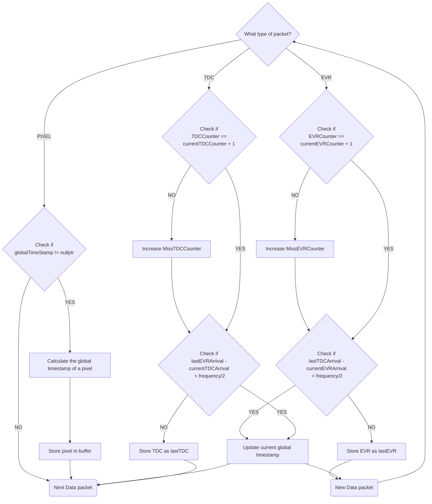

## Data processing logic
Timepix data processing handles 3 kind of data type:
* TDC: Camera clock timesamp produced for EVR pulse
* EVR: ESS timestamps from EVR, produced for each EVR pulse
* PIXEL: Activated pixel coordinates and timestamp

To syncronize data according to the EVR system we synconize EVR and TDC times by pairing them according to their arrival. Then later each pixel must be associated to a certain TDC for the clock calculation and for the groupping withthe EVR time header. The charts below introduce the pairing mechanism:

### TDC and EVR pairing mechanism
