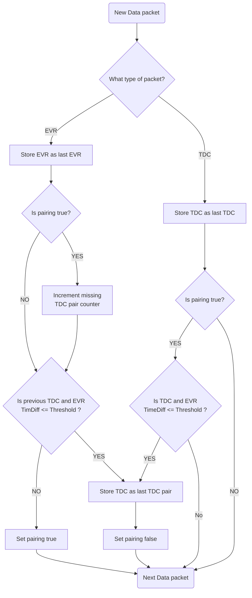

## Data processing logic

```mermaid
flowchart TD

Parsing{What type of packet?}
PairingTDC{Is pairing true?}
PairingEVR{Is pairing true?}
FindPairPreviousTDC{Is previous TDC and EVR\nTimDiff <= Threshold ?}
FindPairTimeDiff{Is TDC and EVR \nTimeDiff <= Threshold ?}

SetPairingTrue[Set pairing true]
SetPairingFalse[Set pairing false]
StoreEVRData[Store EVR as last EVR]
StoreTDCData[Store TDC as last TDC]
StoreTDCPair[Store TDC as last TDC pair]
MissingTDCPair[Increment missing\nTDC pair counter]

NextPacket(Next Data packet)
NewPacket(New Data packet)

NewPacket --> Parsing
Parsing -->|EVR| StoreEVRData --> PairingEVR
Parsing -->|TDC| StoreTDCData --> PairingTDC

PairingTDC -->|YES| FindPairTimeDiff
PairingTDC -->|NO| NextPacket
PairingEVR -->|NO| FindPairPreviousTDC
PairingEVR -->|YES| MissingTDCPair

MissingTDCPair --> FindPairPreviousTDC

FindPairTimeDiff -->|YES| StoreTDCPair --> SetPairingFalse
FindPairTimeDiff -->|No| NextPacket

FindPairPreviousTDC -->|NO| SetPairingTrue --> NextPacket
FindPairPreviousTDC -->|YES| StoreTDCPair

SetPairingFalse --> NextPacket
```