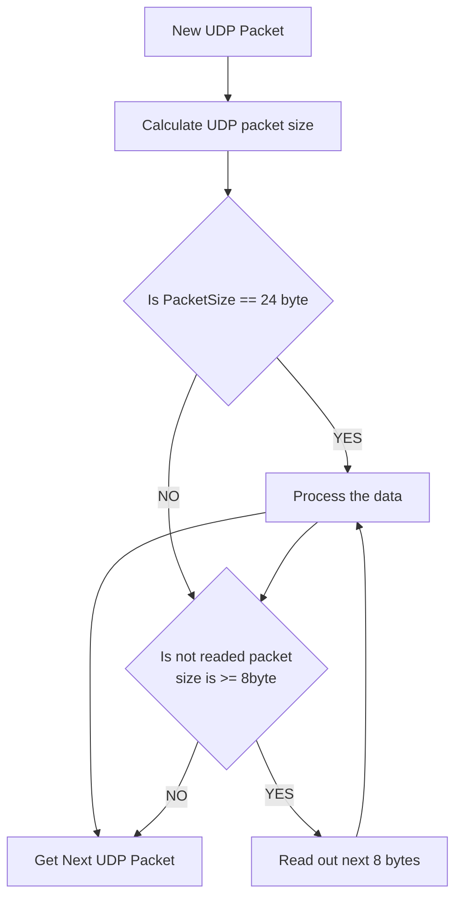
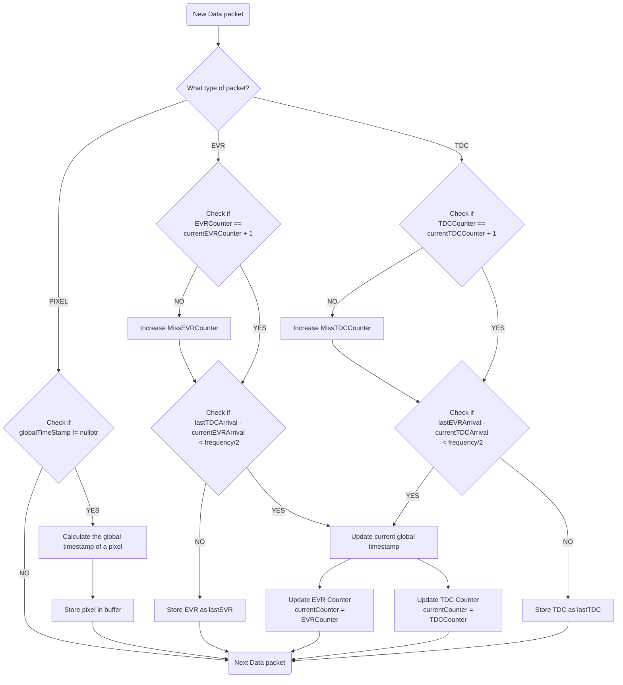

## Data processing logic
Timepix data processing handles 3 kind of data type:
* TDC: Camera clock timesamp produced for EVR pulse
* EVR: ESS timestamps from EVR, produced for each EVR pulse
* PIXEL: Activated pixel coordinates and timestamp

### TDC and EVR syncronization
To syncronize data according to the EVR system we synconize EVR and TDC times by pairing them according to their arrival. We check for the arrival difference between the last received EVR or TDC and the currently received packet. If this difference is small enough then we consider these two packets as pairs and we create a **global time** object. The object stores the global time stamp which is expressed in EPOCH nanosecound precesion and it stores also the releated TDC timestamp.

```marmaid
classDiagram

class GlobalTime {
    + const uint64_t globalTimeStamp
    + const uint32_t tdcTimeStamp
    + GlobalTime(globalTimeStamp, tdcTimeStamp)
}
```

## Pixel data processing

For pixel data we calculate their arrival time in EPOCH nanosec global time domain from the previously identified global timestamp.


### Packet processing mechanism
Following chart will introduce the how we process each UDP packets. In case of EVR the UDP packet contains only one segment, therefore we use one processing step. The other cases we process the segments in 8 bytes until we read out all data from the UDP packet.


The following charts introduce how we process each data segment of the UDP.



### Pixel Time calculation
